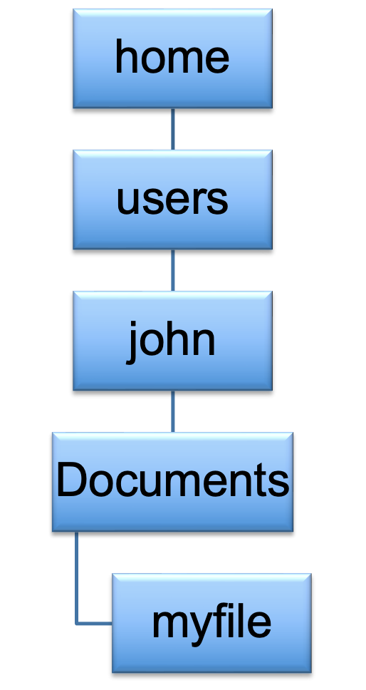
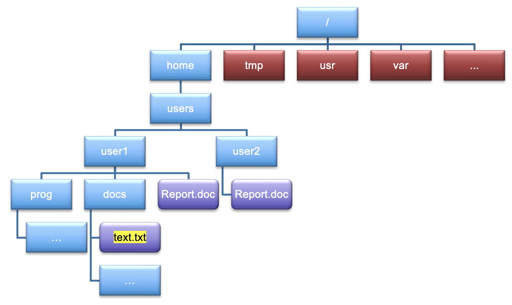

## The directory tree

If you are used to using click and select GUI operations for finding your way through files and folders on your
computer, then using the command line to navigate around for the first time is similar to being dropped into a 
thick maze in the dark without a torch. 

In Linux, everything is a file or a process, even directories. In Linux, folders are referred to as **directories**.
A directory is a file itself, one which contains references to other files. 

Each file has its own unique ID formed from the file name and a list of directories. This is why it is possible to have
different files with the same name in different directories, you have a unique identifier in the file system.

In the same way on Windows and Mac that you select folders and click to go deeper into the file system, Linux has this
method to by using what is known as the **directory tree**. You can see this in action on a Windows machine through the
top Search bar, and you can move around the directory tree using the forward and backwards arrow symbols. In Linux 
however, we need to physically tell the computer where we want to go.

This is what paths are used for. A path is essentially a route that traverses through a directory tree, which each
branch and "forks" in the tree separated by the `/` symbol. This symbol also denotes the **root** directory, the point
at which all directory trees start from. On Windows machines, in the Cmd prgoram, it is denoted with `\`. The root 
directory is usually restricted for administrative use. If you are on a desktop, you have access to this root 
directory. For supercomputers, this is restricted.

> ## Slashes
>
> Notice that there are two meanings for the `/` character.
> When it appears at the front of a file or directory name,
> it refers to the root directory. When it appears *inside* a path,
> it's just a separator.
{: .callout}

Let us look at a simple directory structure. This is an important concept to grasp as you move through a file system.

Each of the boxes refers to a directory, and the tree ends at `myfile`. You can see how the idea of a path arises, so
lets add some slashes in here to turn this directory structure into a path.

`/home/users/john/Documents/myfile`

This is what is known as an **absolute path**, which refers as the route from the root directory, to the file that we are
looking at, being `myfile`.

However, when we log into a machine, we are never put in the root directory. We are put in the home directory of whoever
is using the machine. John is logging on, so naturally he wants to be put where his material is. This is where we
introduce the term **relative path**, which is the path to a file or folder relative to where you are at any time. The
relative path in this case is;

`john/Documents/myfile`

We are in the directory `john`, and we wish to see the path to my file relative from where we are. Relative paths can
be more complex as we stay in one place and try and find a route to other places in our tree. But we will deal with
that later, let's look into our first few exercises.

> ## Locating yourself in a directory tree
>
> Given what you have learned so far, let's make things a bit trickier with a more complicated tree structure. Put into
> the chat the following;
> 
> 1. The absolute path to `text.txt`
> 2. The relative path to `text.txt` if you are in the `user1` directory.
> 
> 

> 
> > ## Solution
> >
> > 1. `/home/users/user1/docs/text.txt`
> > 2. `./docs/text.txt`
> >
> {: .solution}
{: .challenge}

## Navigating around

Before we dive into the most commonly used commands for navigation, we should look at a command which creates some
empty files we can play around with.

> ## The `touch` command
>
> This command is not for navigation purposes, but will be useful for generating empty files for us to help with 
> navigation.
> 
> By typing `touch ABC`, we create an empty file called `ABC`. Here, `touch` is the command and `ABC` is the argument
> we pass to it. 
>
> Be careful with whitespace, as if you type `touch A B C`, it will create 3 files, `A`, `B` and `C`. This is why using
> underscores (`_`) or hyphens (`-`) is often considered best practice.
>
> The command `touch A_B_C` will therefore create a single file `A_B_C`.
>
{: .callout}

> ## Create an empty file
>
> Create a **single** file with a name of your choice. If it has multiple words, separate them with `_` or `-`
> 
{: .challenge}

### The `pwd` command

One of the most important things to know in Linux at any point is where you actually are. This, thankfully is easy to
do in Linux by running a command called `pwd` (which stands for 'print working directory'). Remember that directories
are like *places* - at any time while we are using the shell we are in exactly one place, called our 
**current working directory**. Directories in Linux are the same as folders. Commands mostly read and write files in
the current working directory, i.e. 'here', so knowing where you are before running a command is important. `pwd` shows 
you where you are:

~~~
$ pwd
~~~
{: .language-bash}

Your output will depend on where you are. As you are starting out, you are likely going to be placed where your shell
considers as "home". You may have something like this.

~~~
/Users/johnsmith
~~~
{: .language-bash}

As you get more used to UNIX commands, you will find that you need this command less and less, but for the moment, 
practice using it whenever you are at any point unsure where you are.

> ## Home Directory Variation
>
> The home directory path will look different on different operating systems. On Linux it may look like
> `/home/johnsmith`, and on Windows it will be similar to `C:\Documents and Settings\johnsmith` or 
> `C:\Users\johnsmith` (Note that it may look slightly different for different versions of Windows.). In future 
> examples, we've used Mac output as the default - Linux and Windows output may differ slightly but should be generally
> similar.
>
>  
> We will also assume that your `pwd` command returns your users home directory. If `pwd` returns something different
> you may need to navigate there using `cd` or some commands in this lesson will not work as written. See
> [The `cd` command](#the-cd-command) for more details on the `cd` command.
{: .callout}

### The `ls` command

We saw this command before in the [previous episode](01-introducing-linux.md), but now lets go into more details. This
is one of the most commonly used commands you will get to use.

`ls` prints the names of the files and directories in the current directory as we saw previously, but we can make its 
output more comprehensible by using the `-F` **option** which tells `ls` to classify the output by adding a marker to
file and directory names to indicate what they are:
- a trailing `/` indicates that this is a directory
- those with an extension `.docx`, `.c` or sometimes no extension are regular files

Depending on your default options, the shell might also use colours to indicate whether each entry is a file or
directory, or an executable.

~~~
$ ls -F
~~~
{: .language-bash}

~~~
Applications/ Documents/    Library/      Music/        Public/
Desktop/      Downloads/    Movies/       Pictures/
~~~
{: .output}

Let us now use the `-a` flag as before, which shows **all** the files in a directory. Now, execute the command below;

~~~
$ ls -aF
~~~
{: .language-bash}

You may have noticed a big change, with items that may look something like this; 

~~~
./            ../           .anaconda/    .bash_history/ .ssh/
Applications/ Documents/    Library/      Music/         Public/
Desktop/      Downloads/    Movies/       Pictures/
~~~
{: .output}

You can see that some new options have appeared with a `.` beforehand. These are hidden files or directories which do
not appear in normal view. The single `.` refers to the directory you are currently in. `..` on the other hand refers
to the directory above the one that you are in. We will look more into details about this as we look into moving around
directories.

Let's say we want to list all the directories that start with the letter D, we can use a handy key called `Tab` which
lists out a bunch of options.

~~~
$ ls D
~~~
{: .language-bash}

~~~
Documents/    Desktop/      Downloads/
~~~
{: .output}

`Tab` can also help autocomplete. Typing the following followed by pressing `Tab` will autocomplete the word `Desktop`

~~~
$ ls De
~~~
{: .language-bash}

~~~
Desktop/
~~~
{: .output}

### The `cd` command

We next move onto the command that you will use most often, `cd` which stands for 'change directory'. This command is
akin to double clicking a folder in a graphical interface to get into a folder.

But `cd` alone isn't enough, we need to follow it with a directory name to change our working directory.

Let's say we want to move into our Desktop directory. Using our trick from above with the `Tab` key will ensure that 
the directory exists, and will autocomplete.

~~~
$ cd Desktop
$ pwd
~~~
{: .language-bash}

~~~
/Users/johnsmith/Desktop
~~~
{: .output}

Note how the present working directory has changed from when we initially used the [`pwd` command](#the-pwd-command). 
We recommend to use this every time you change directory, like leaving breadcrumbs in the famous Hansel and Gretel
story.

Now let's say we want to go back to where we were. We can do two things. The first is type `cd` by itself, but this
will always put us back in the home directory, regardless of where we call it. It is a handy feature, but can cause you
to get lost quickly! The more commonly used way is by referencing our "upper directory" which we covered above.

~~~
$ cd ..
$ pwd
~~~
{: .language-bash}

~~~
/Users/johnsmith
~~~
{: .output}

Using this we are back in the directory above where we are

> ## Whitespace matters
>
> For all Linux commands, whitespace is of paramount importance when feeding arguments into a command. Commands like
> `ls-l`, and `cd..` will not work, and you will get an error saying;
> 
> ~~~
> command not found
> ~~~
> {: .output}
>
> This error signifies a typo which needs correcting
{: .callout}

> ## Practice using `cd`
>
> Experiment with the cd command and see what happens when you try and use cd along with the following arguments. Don't
> forget to use `pwd` to tell you where you are at any time.
>
> 1. `..`
> 2. Nothing
> 3. `.`
> 4. `new`
> 5. `../../`
> 6. `~`
{: .challenge}

In the next episode, we will create a number of directories and then practice the `cd` command with a file structure
that we created ourselves.

> ## What works with `cd`?
>
> Match up the situations below with their expected output. Assume that you are in a directory which contains a single
> directory, `Documents`.
> 
> | Command        | Outcome                                  |
> |----------------|------------------------------------------|
> | `cd`           | Moves back one directory                 |
> | `cd.`          | `No such file or directory`              |
> | `cd Desktop`   | Moves you back two directories           |
> | `cd ../..`     | Moves you back into the "home" directory |
> | `cd ..`        | Does nothing, as you are already here    |
> | `cd Documents` |`command not found`                       |
> | `cd ~`         | Moves you back into the "home" directory |
> | `cd .`         | Moves you into `Desktop`                 |
> 
> > ## Solution
> >
> > | Command        | Outcome                                  |
> > |----------------|------------------------------------------|
> > | `cd`           | Moves you back into the "home" directory |
> > | `cd.`          |  `command not found`                     |
> > | `cd Desktop`   | Moves you into `Desktop`                 |
> > | `cd ../..`     | Moves you back two directories           |
> > | `cd ..`        | Moves back one directory                 |
> > | `cd Documents` | `No such file or directory`              |
> > | `cd ~`         | Moves you back into the "home" directory |
> > | `cd .`         | Does nothing, as you are already here    |
> >
> {: .solution}
{: .challenge}

## Getting help

There are a couple of ways of getting help in Linux for a command, lets take `ls` as an example

1. We can pass a `--help` option to the command, such as:
    ~~~
    $ ls --help
    ~~~
    {: .language-bash}

2. We can read its manual with `man`, such as:
    ~~~
    $ man ls
    ~~~
    {: .language-bash}

Depending on your environment you might find that only one of these works (either `man` or `--help`, e.g., `man` works
for macOS and `--help` typically works for Git Bash).

We'll describe both ways below.

### The `--help` option

Many bash commands, and programs that people have written that can be
run from within bash, support a `--help` option to display more
information on how to use the command or program.

~~~
$ ls --help
~~~
{: .language-bash}

### The `man` command

The other way to learn about `ls` is to type
~~~
$ man ls
~~~
{: .language-bash}

The command `man` is short for manual. This will turn your terminal into a page with a description
of the `ls` command and its options.

To navigate through the `man` pages, you may use `↑` and `↓` to move line-by-line,
or try `B` and `Spacebar` to skip up and down by a full page. To search for a character or word in the `man` pages,
use `/` followed by the character or word you are searching for. Sometimes a search will result in multiple hits. If
so, you can move between hits using `N` (for moving forward) and `Shift + N` (for moving backward).

To **quit** the `man` pages, press `Q`.

> ## Manual pages on the web
>
> Of course there is a third way to access help for commands:
> searching the internet via your web browser.
> When using internet search, including the phrase `unix man page` in your search
> query will help to find relevant results.
>
> GNU provides links to its
> [manuals](http://www.gnu.org/manual/manual.html) including the
> [core GNU utilities](http://www.gnu.org/software/coreutils/manual/coreutils.html),
> which covers many commands introduced within this lesson.
{: .callout}

### The `history` command

Although not a command for getting help, it is very helpful when typing lots of commands, as one can easily forget what
commands you have typed.

~~~
$ history
~~~
{: .language-bash}

~~~
1 pwd
2 ls
3 ls -F
...
~~~
{: .output}

The shell stores up to the last 1000 commands, and you can use pipes to search through to find specific commands. We
will cover pipes in [episode 4](04-useful-tools.md).

